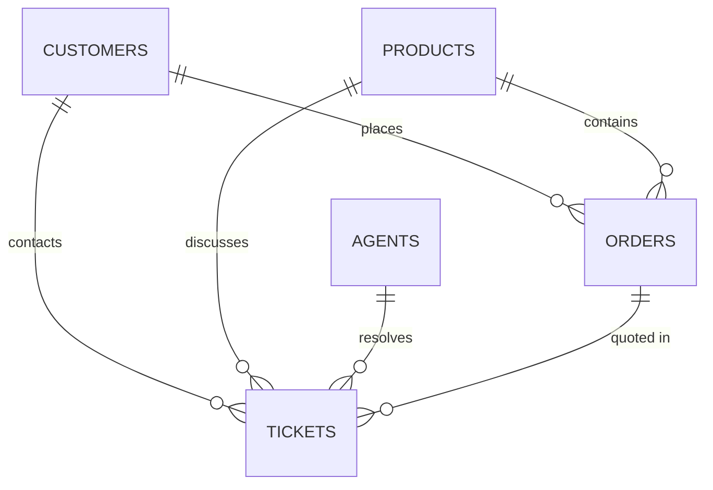

# Vireo Audio Customer Support Intelligence
## Phase 1 — Data Foundation & Comprehensive Data Quality Audit Report (Corrected)

**Report Generated:** 2026-09-30 15:52:13  
**Auditor:** Senior Data/Software Engineering Lead  
**Scope:** Raw Production Datasets (1 January 2025 – 30 June 2026)  
**Status:** Audit Complete, Reconciled & Verified

---

## 1. Executive Summary

A comprehensive, non-destructive data quality audit was conducted on the complete 18-month Vireo Audio customer support dataset covering **1 January 2025 through 30 June 2026**.

### Key Highlights
- **100% Core Referential Integrity:** All tickets reference valid `customer_id` (12,528/12,528), `product_sku` (12,528/12,528), and `agent_id` (12,528/12,528). All present `order_id` values (8,310) reference valid orders in `orders.csv`.
- **Legacy Re-Import Duplication:** Identified **653 duplicated ticket IDs** (1,306 total rows) created during the Freshdesk-to-New Helpdesk migration on **14 September 2025**. Exactly one copy exists under `source_system = 'helpdesk'` and one under `source_system = 'legacy_fd'`. Per data retention principles, both are preserved and tagged.
- **Legacy Timestamp Ordering Anomaly:** Identified **2,263 tickets** where `resolved_at < created_at` and **2,472 tickets** where `resolved_at < first_response_at`. **100% of these anomalies originate from `legacy_fd`**. While Sameer noted legacy resolution times were reconstructed from event logs, the exact mechanism cannot be proven from export CSVs alone. We document this as a *legacy timestamp ordering anomaly requiring further verification*, preserve the raw timestamps intact, and set handle time to `NaN` for inverted records.
- **Legacy CSAT Encoding:** Identified **2,083 tickets** with `csat_score = 0.0`, all within `legacy_fd`. In accordance with Operating Policy v3.2, score 0 represents legacy non-response and has been sanitized to `NaN` in downstream normalized views.
- **Fallback Order Resolution:** For all **4,218 ticket rows** where customer did not quote `order_id`, row-level matching by `(customer_id, product_sku)` resolves **3,467 rows (82.19%) uniquely**, while **751 rows (17.81%)** have ambiguous multi-order histories and are safely retained as null. Across unique ticket IDs (4,023), **3,303 are unique (82.10%)** and **720 are ambiguous (17.90%)**. Exactly **0 rows are unmatched** (100% of customers have matching purchase history).
- **Policy Compliance Exceptions:** Found **4 tickets** where both refund and replacement were issued simultaneously (violating single-remedy policy), and **38 tickets exceeding the ₹500 goodwill threshold** (the dataset lacks approval metadata to verify whether required Team Lead approval occurred).

---

## 2. Dataset Topologies & Record Counts

| Dataset | File Name | Raw Row Count | Primary Key | Key Column Integrity | Null Rate (%) |
| :--- | :--- | :--- | :--- | :--- | :--- |
| **Tickets** | `tickets.csv` | 12,528 | `ticket_id` | 11,875 unique (653 dup pairs) | 0.0% ID nulls |
| **Agents** | `agents.csv` | 44 | `agent_id` + `from_date` | 44 unique agents (roster) | 0.0% ID nulls |
| **Customers** | `customers.csv` | 9,500 | `customer_id` | 9,500 unique customers | 0.0% ID nulls |
| **Orders** | `orders.csv` | 15,000 | `order_id` | 15,000 unique orders | 0.0% ID nulls |
| **Products** | `products.csv` | 14 | `sku` | 14 unique SKUs | 0.0% ID nulls |

---

## 3. Schema & Column Validation

All datasets strictly adhere to documented schemas with zero missing or unexpected columns.

### 3.1 Field-by-Field Null & Completeness Audit (Tickets)
| Column Name | Data Type | Null Count | Null Rate (%) | Domain / Status Note |
| :--- | :--- | :--- | :--- | :--- |
| `ticket_id` | String | 0 | 0.00% | 11,875 unique IDs |
| `created_at` | Timestamp | 0 | 0.00% | Full date range: 2025-01-01 to 2026-06-30 |
| `first_response_at` | Timestamp | 0 | 0.00% | 100% present |
| `resolved_at` | Timestamp | 644 | 5.14% | Nulls exactly match `open` (399) + `pending` (245) tickets |
| `status` | Categorical | 0 | 0.00% | resolved: 10,716, closed: 1,168, open: 399, pending: 245 |
| `channel` | Categorical | 0 | 0.00% | chat: 5,439, email: 4,025, voice: 1,800, social: 1,264 |
| `customer_id` | FK String | 0 | 0.00% | 100% matched against `customers.csv` |
| `order_id` | FK String | 4,218 | 33.67% | Legitimate omission when customer does not quote |
| `product_sku` | FK String | 0 | 0.00% | 100% matched against `products.csv` |
| `category` | Categorical | 0 | 0.00% | Tagged on intake / closure |
| `priority` | Categorical | 0 | 0.00% | Normal: 8,967, High: 2,161, Low: 1,400 |
| `assigned_team` | Categorical | 0 | 0.00% | Initial routing team |
| `agent_id` | FK String | 0 | 0.00% | 100% matched against `agents.csv` |
| `transfers` | Integer | 0 | 0.00% | 0 to 2 hand-offs (mean: 0.099) |
| `csat_score` | Float | 4,856 | 38.76% | Raw nulls: 4,856; Legacy zeros: 2,083 |
| `refund_amount_inr` | Float | 10,303 | 82.24% | Populated when refund raised (2,225 rows) |
| `refund_reason_code` | Categorical | 10,303 | 82.24% | Matches refund amounts (2,225 rows) |
| `replacement_issued`| Categorical | 0 | 0.00% | N: 11,256, Y: 1,272 |
| `customer_message` | Text | 0 | 0.00% | 100% populated |
| `agent_notes` | Text | 0 | 0.00% | 100% populated |
| `source_system` | Categorical | 0 | 0.00% | helpdesk: 8,766, legacy_fd: 3,762 |

---

## 4. Referential Integrity & Fallback Order Resolution

### 4.1 Cross-Dataset Key Integrity Matrix
- **`tickets.customer_id` -> `customers.customer_id`**: **100.0%** (12,528/12,528 valid)
- **`tickets.product_sku` -> `products.sku`**: **100.0%** (12,528/12,528 valid)
- **`tickets.agent_id` -> `agents.agent_id`**: **100.0%** (12,528/12,528 valid across all 44 agents)
- **`orders.customer_id` -> `customers.customer_id`**: **100.0%** (15,000/15,000 valid)
- **`orders.sku` -> `products.sku`**: **100.0%** (15,000/15,000 valid)
- **`tickets.order_id` -> `orders.order_id`**: **100.0%** of non-null IDs (8,310/8,310 valid)

### 4.2 Fallback Resolution for Missing `order_id` (Mutually Exclusive & Collectively Exhaustive)
For the 4,218 ticket rows where `order_id` is missing, we match `(customer_id, product_sku)` against `orders.csv`:

| Resolution Category | Row Count | Row Pct (%) | Unique Ticket IDs | Unique Ticket Pct (%) | Definition / Treatment |
| :--- | :--- | :--- | :--- | :--- | :--- |
| **Unique Match** | **3,467** | **82.19%** | **3,303** | **82.10%** | Exactly 1 historical order found for customer + SKU; mapped to `order_id_inferred`. |
| **Ambiguous Match** | **751** | **17.81%** | **720** | **17.90%** | >1 historical orders found for customer + SKU; safely retained as `NaN`. |
| **Unmatched** | **0** | **0.00%** | **0** | **0.00%** | 0 orders found for customer + SKU. |
| **Total Missing `order_id`** | **4,218** | **100.00%** | **4,023** | **100.00%** | Reconciles exactly: `3,467 + 751 + 0 = 4,218`. |

---

## 5. Timestamp Quality & Migration Reconstruction Analysis

### 5.1 Chronological Consistency Check
- **`first_response_at >= created_at`**: **100.0% Valid** (0 breaches across all 12,528 records).
- **`resolved_at < created_at`**: **2,263 anomalies** (all 2,263 in `legacy_fd`, 0 in `helpdesk`).
- **`resolved_at < first_response_at`**: **2,472 anomalies** (all 2,472 in `legacy_fd`, 0 in `helpdesk`).

### 5.2 Finding & Treatment
- **Finding:** Legacy timestamp ordering anomaly requiring further verification.
- **Treatment:** Raw timestamps are strictly preserved. In normalized views, `handle_time_minutes` is computed only when `resolved_at >= first_response_at` and set to `NaN` for inverted legacy timestamps.

---

## 6. Channel SLAs & Response Performance Audit

| Channel | SLA Target | Total Tickets | Breached SLA Count | Breach Rate (%) | Store Credit Liability (@ Rs 350) |
| :--- | :--- | :--- | :--- | :--- | :--- |
| **Chat** | 15 mins | 5,439 | 1,489 | 27.38% | Rs 5,21,150 |
| **Voice Callback** | 120 mins (2 hrs) | 1,800 | 545 | 30.28% | Rs 1,90,750 |
| **Social** | 240 mins (4 hrs) | 1,264 | 393 | 31.09% | Rs 1,37,550 |
| **Email** | 480 mins (8 hrs) | 4,025 | 1,223 | 30.39% | Rs 4,28,050 |
| **Overall** | — | **12,528** | **3,650** | **29.13%** | **Rs 12,77,500** |

---

## 7. Business Policy & Governance Compliance Findings

### 7.1 Mutual Exclusivity Violation (Refund + Replacement)
- **Policy Rule:** A customer must never receive both a refund and a replacement for the same order without immediate Team Lead and Finance escalation.
- **Finding:** **4 tickets** have both `refund_amount_inr > 0` and `replacement_issued = 'Y'`:
  - `TK-241405` (Order `VR892778`, Logistics team, Rs 2,499 refund + replacement)
  - `TK-244372` (Order `VR908861`, Email Frontline, Rs 1,499 refund + replacement)
  - `TK-250483` (Order `VR883328`, Logistics team, Rs 3,499 refund + replacement)
  - `TK-252411` (Order `VR885453`, Logistics team, Rs 2,499 refund + replacement)
- **Severity:** HIGH (Operational leak / dual settlement requiring Finance audit).

### 7.2 Goodwill Refund Cap Thresholds
- **Policy Rule:** Goodwill credits (`GW-OTHER`) are capped at ₹500 per ticket and require Team Lead approval.
- **Finding:** **38 tickets** exceed the ₹500 goodwill threshold, and the supplied dataset does not contain sufficient approval metadata to verify whether required Team Lead approval occurred.
- **Severity:** MEDIUM (Requires operational review of escalation logs).

### 7.3 Tier 1 vs Tier 2 Replacement Approvals
- **Policy Rule:** Tier 2 (Escalations & Warranty) owns certified warranty replacements; Tier 1 handles intake, account, and logistics reshipments.
- **Finding:** Out of 1,272 replacements:
  - Tier 1 agents resolved **1,049 replacements** (predominantly Logistics reshipments for transit issues and DOA).
  - Tier 2 agents resolved **223 replacements** (certified RMA warranty hardware claims).
- **Severity:** INFORMATIONAL (Confirms operational split between logistics replacements and warranty hardware RMAs).

---

## 8. Structured Finding Catalog

| ID | Issue Description | Dataset | Column | Affected Rows | Severity | Downstream Treatment |
| :--- | :--- | :--- | :--- | :--- | :--- | :--- |
| **F-01** | Legacy re-import duplicate ticket IDs across helpdesk & legacy_fd | `tickets.csv` | `ticket_id` | 1,306 (653 pairs) | **HIGH** | Preserve raw records; retain `source_system` flag; deduplicate safely in aggregate reports. |
| **F-02** | Legacy timestamp ordering anomaly requiring further verification | `tickets.csv` | `resolved_at` | 2,472 | **HIGH** | Treat handle time as `NaN` for inverted timestamps; do not discard tickets. |
| **F-03** | Legacy CSAT score 0 used for survey non-response | `tickets.csv` | `csat_score` | 2,083 | **MEDIUM** | Mapped to `NaN` in `csat_score_clean`; exclude from CSAT averages per policy. |
| **F-04** | Missing `order_id` on initial customer contact | `tickets.csv` | `order_id` | 4,218 | **INFORMATIONAL** | Resolved 3,467 rows uniquely via `order_id_inferred`; leave 751 ambiguous rows as `NaN`. |
| **F-05** | Simultaneous refund and replacement issued on same ticket | `tickets.csv` | `refund_amount_inr`, `replacement_issued` | 4 | **HIGH** | Flag for finance and operations exception audit. |
| **F-06** | Goodwill refunds exceeding ₹500 threshold | `tickets.csv` | `refund_amount_inr` | 38 | **MEDIUM** | Note lack of approval metadata in dataset; flag for verification. |
| **F-07** | High first-response SLA breach rate (~29.1%) | `tickets.csv` | `first_response_at` | 3,650 | **HIGH** | Account for Rs 12.77L automatic store credit liability in financial reporting. |

---

## 9. Normalization Decisions & Derived Fields Catalog

| Field Name | Type | Formula / Logic | Purpose |
| :--- | :--- | :--- | :--- |
| `created_date` | Date String | `created_at.strftime('%Y-%m-%d')` | Daily aggregation partition |
| `created_week` | String | `created_at.strftime('%Y-W%W')` | Weekly digest grouping |
| `created_month`| String | `created_at.strftime('%Y-%m')` | Monthly trend analysis |
| `first_response_minutes` | Float | `(first_response_at - created_at) / 60` | SLA response measurement |
| `handle_time_minutes` | Float | `(resolved_at - first_response_at) / 60` if valid else `NaN` | Safe resolution handle duration |
| `is_resolved_or_closed` | Boolean | `status.isin(['resolved', 'closed'])` | Attendance measurement |
| `is_legacy` | Boolean | `source_system == 'legacy_fd'` | Migration segment isolation |
| `csat_score_clean` | Float | `csat_score` with `0.0 -> NaN` | True customer satisfaction score |
| `has_csat` | Boolean | `csat_score_clean.notnull()` | CSAT participation flag |
| `has_refund` | Boolean | `refund_amount_inr > 0` | Financial impact flag |
| `has_replacement` | Boolean| `replacement_issued == 'Y'` | Inventory replacement flag |
| `has_order_id` | Boolean | `order_id.notnull()` | Quoted order identifier flag |
| `order_id_inferred` | String | Unique fallback match on `(customer_id, sku)` | Deterministic order recovery |
| `sla_target_minutes`| Integer| Mapped by channel (15, 120, 240, 480) | SLA policy baseline |
| `is_sla_breached` | Boolean | `first_response_minutes > sla_target_minutes` | SLA compliance flag |

---

## 10. Downstream Directives for Phase 2+

1. **Volume Ranking Governance:** Per Neha Kulkarni's operational mandate, Tier 2 / Warranty agents (Escalations & Warranty) must **never** be ranked on raw ticket counts. Their performance must be evaluated on resolution handle time in days and RMA quality.
2. **CSAT Calculations:** Always use `csat_score_clean` to prevent 0-value distortion of customer satisfaction ratings.
3. **Handle Time Metrics:** Omit `legacy_fd` tickets with inverted timestamps from handle time averages.
4. **Duplicate Re-Imports:** When computing weekly volume digests, aggregate across deduplicated unique ticket entities or explicitly partition by source system.
